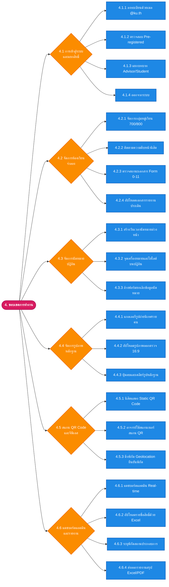

# 4. ขอบเขตการทำงาน (Scope of Work)

นี่คือแผนภาพโครงสร้างขอบเขตการทำงาน (Scope of Work) ของระบบทั้งหมด แบ่งออกเป็น 6 โมดูลหลักตามรายละเอียดขอบเขตการทำงาน

```mermaid
graph LR
    Root([<b>4. ขอบเขตการทำงาน</b>]) --> M1{4.1 การเข้าสู่ระบบ<br>และแยกสิทธิ์}
    Root --> M2{4.2 จัดการห้องเรียน<br>จำลอง}
    Root --> M3{4.3 จัดการนัดหมาย<br>ปฏิทิน}
    Root --> M4{4.4 จัดการรูปภาพ<br>หลักฐาน}
    Root --> M5{4.5 สแกน QR Code<br>และจีพีเอส}
    Root --> M6{4.6 แดชบอร์ดแอดมิน<br>และรายงาน}

    %% 4.1 Subs
    M1 --> M1_1[4.1.1 ลงทะเบียนด้วยเมล @ku.th]
    M1 --> M1_2[4.1.2 ตรวจสอบ Pre-registered]
    M1 --> M1_3[4.1.3 แยกบทบาท Advisor/Student]
    M1 --> M1_4[4.1.4 ออกจากระบบ]

    %% 4.2 Subs
    M2 --> M2_1[4.2.1 จัดการกลุ่มหมู่เรียน 700/800]
    M2 --> M2_2[4.2.2 ติดตามความคืบหน้านิสิต]
    M2 --> M2_3[4.2.3 ตรวจสถานะเอกสาร Form 0-11]
    M2 --> M2_4[4.2.4 อัปโหลดเอกสารรายงานประเมิน]

    %% 4.3 Subs
    M3 --> M3_1[4.3.1 สร้างวันเวลานัดหมายล่วงหน้า]
    M3 --> M3_2[4.3.2 จุดเครื่องหมายและไฮไลต์บนปฏิทิน]
    M3 --> M3_3[4.3.3 ล้างฟอร์มยกเลิกข้อมูลนัดหมาย]

    %% 4.4 Subs
    M4 --> M4_1[4.4.1 แกลเลอรีรูปถ่ายนิเทศรายคน]
    M4 --> M4_2[4.4.2 อัปโหลดรูปภาพออกตรวจ 16:9]
    M4 --> M4_3[4.4.3 ปุ่มลบและเคลียร์รูปหลักฐาน]

    %% 4.5 Subs
    M5 --> M5_1[4.5.1 นิสิตแสดง Static QR Code]
    M5 --> M5_2[4.5.2 อาจารย์ใช้สแกนเนอร์สแกน QR]
    M5 --> M5_3[4.5.3 ดึงพิกัด Geolocation ยืนยันพิกัด]

    %% 4.6 Subs
    M6 --> M6_1[4.6.1 แดชบอร์ดแอดมิน Real-time]
    M6 --> M6_2[4.6.2 อัปโหลดรายชื่อสิทธิ์ด้วย Excel]
    M6 --> M6_3[4.6.3 ระบุพิกัดสถานประกอบการ]
    M6 --> M6_4[4.6.4 ส่งออกรายงานสรุป Excel/PDF]

    %% Styling
    classDef rootStyle fill:#D81B60,stroke:#AD1457,stroke-width:2px,color:#fff;
    classDef moduleStyle fill:#FB8C00,stroke:#EF6C00,stroke-width:2px,color:#fff;
    classDef featureStyle fill:#1E88E5,stroke:#1565C0,stroke-width:2px,color:#fff;

    class Root rootStyle;
    class M1,M2,M3,M4,M5,M6 moduleStyle;
    class M1_1,M1_2,M1_3,M1_4,M2_1,M2_2,M2_3,M2_4,M3_1,M3_2,M3_3,M4_1,M4_2,M4_3,M5_1,M5_2,M5_3,M6_1,M6_2,M6_3,M6_4 featureStyle;
```
